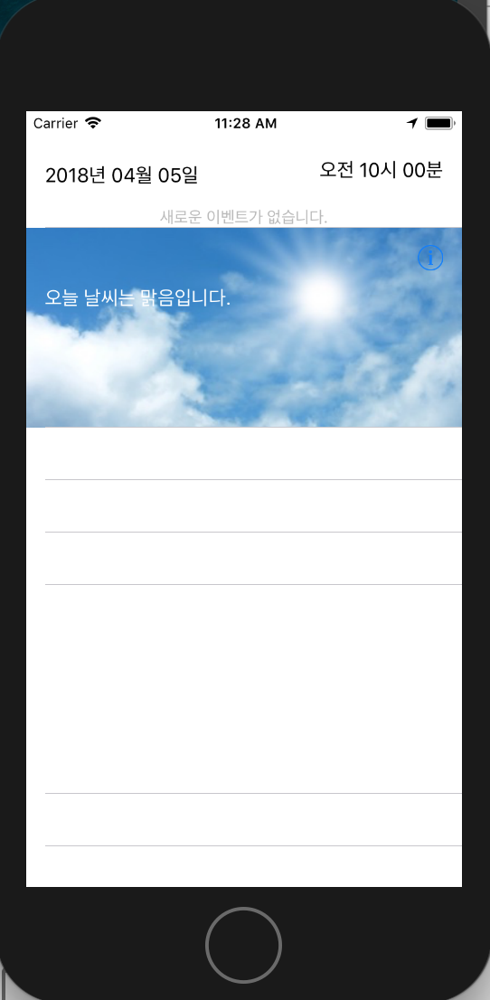
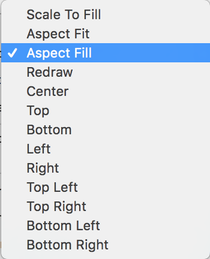
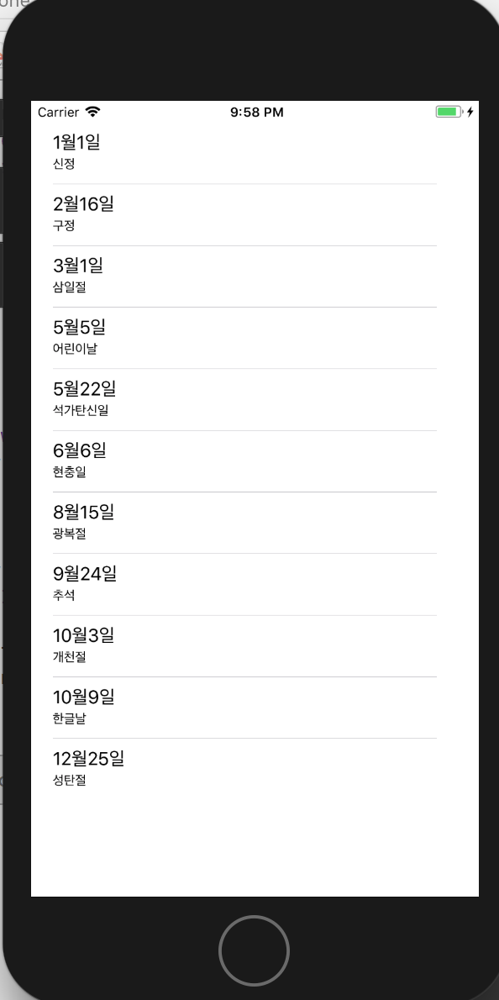
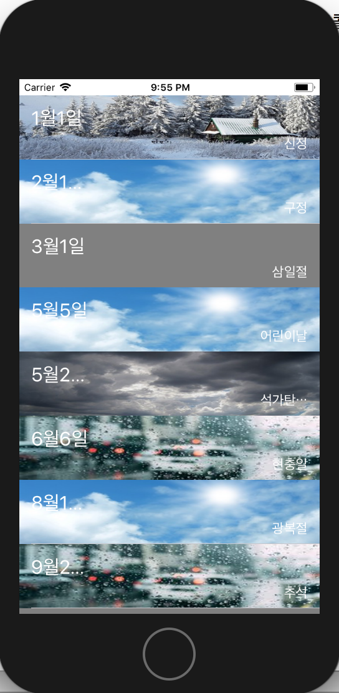
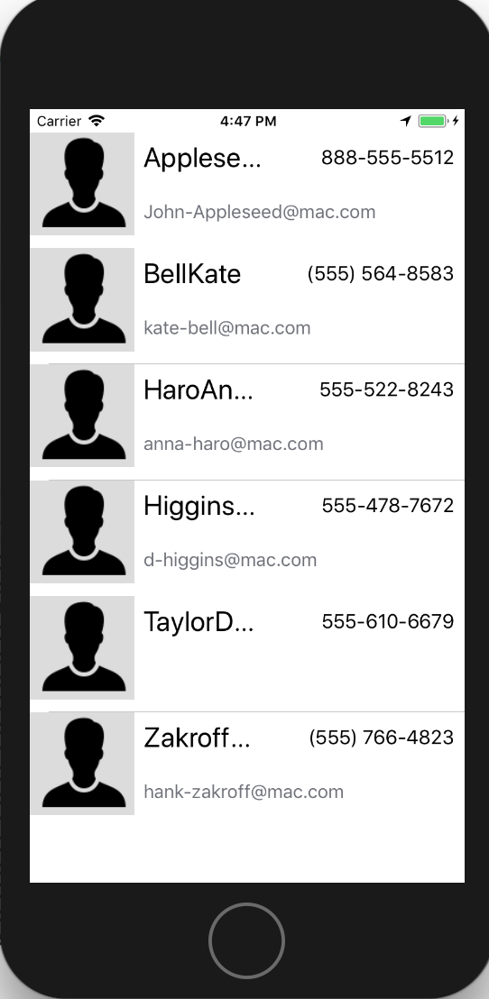

# swift-addressbookapp step1
iOS 레벨3 주소록 앱 저장소

> 시작하기 - UITableViewController

- ***실행화면***


- ***학습꺼리***

1. 이미지 채우는 contentMode에 대해 학습한다.


: contentMode에는 위와 같은 여러가지 mode가 있는데 이 중에서 헷갈리는 3가지에 대해서 정리해본다.  
	1) Scale To Fill: 화면에 맞춰서 이미지의 가로, 세로를 늘린다.  
	2) Aspect Fit: 이미지를 늘리지 않고 화면에 딱 맞게 정렬한다.  
	3) Aspect Fill: 이미지를 늘리지 않고 화면에 꽉 채워서 정렬한다.  
	
2. UITableViewController를 활용해서 static cell을 디자인하는 방식을 학습한다. 

---

# swift-addressbookapp step2

> DataSource 객체

- ***실행화면***


- ***학습꺼리***

1. UITableViewController와 UIViewController에 UITableView를 추가한 차이를 학습한다.  
: UITableViewController는 delegate와 datasource가 이미 있어서 프로토콜 추가를 할 필요가 없으나, UITabelView의 경우에는 TableView에서 관련 메소드를 사용하기 위해서 UITableViewDataSource, UITableViewDelegate 프로토콜을 추가해야한다. 


2. DataSource 프로토콜을 구현하기 위한 필수 메소드 형식과 동작 방식을 정리한다.  
: 몇 행을 출력할지 지정(tableView(_ tableView: UITableView, numberOfRowsInSection section: Int) -> Int), 특정한 행에 어떤 내용의 셀을 출력할지 지정하는 메소드(tableView(_ tableView: UITableView, cellForRowAt indexPath: IndexPath) -> UITableViewCell)는 필수 메소드이다.

3. Delegate 패턴과 DataSource 프로토콜과 비슷한 점, 차이점은 무엇인지 학습한다.  
: Delegate는 표시되는 모습, 사용자의 터치에 대한 인식, 행의 높이, 들여 쓰기, 행 삭제 및 수정 등의 기능을 제공하고,  
DataSource는 타이틀 정보를 정의하는 메서드와 몇 개의 데이터를 표시할지를 결정하는 메서드, 몇 개의 영역으로 나뉘는지 결정하는 메서드, 표시될 셀 객체를 테이블 뷰에 제공하는 기본 메서드들을 정의하게 된다.  


---

# swift-addressbookapp step3

> DataSource 객체

- ***실행화면***


- ***학습꺼리***

1. 테이블뷰에서 자동으로 결정하는게 아니라 강제로 셀 높이를 지정하는 방법에 대해 학습한다.  
: viewDidLoad()에서 다음 코드를 작성하여 셀 높이를 지정할 수 있다. 

```swift
tableView.rowHeight = 80
```

2. 셀 id별로 재사용하는 방식에 대해 학습한다.  
: 셀 id를 지정해서 다음과 같이 사용할 수 있다.

```swift
guard let cell = tableView.dequeueReusableCell(withIdentifier: Contstant.customCell, for: indexPath) as? HolidayTableViewCell else {
            return HolidayTableViewCell()
        }
```

3. 커스텀 셀을 사용할 때 주의해야 할 사항들을 정리한다.  
: 개인적으로는 커스텀 셀을 사용할 때 레이아웃 잡는 것과 데이터를 받아와서 각각의 타입에 맞게 화면에 보여주는 부분에 주의해야 할 것 같다.  </br></br>
처음엔 레이아웃의 셀 높이가 맞지 않아서 storyboard에서 지정하려고 했으나 설정이 되지 않는 것을 발견하고 구글링을 통해 viewDidLoad()에서 셀 높이를 지정하는 것을 배울 수 있었다.  
또한 이미지 데이터를 넣을 때는 json 데이터를 제대로 가지고 오지 않아 nil값이 계속 나와서 그 이유를 계속 찾았었는데 알고보니 데이터의 key값을 쓸 때 오타가 있었던 것을 발견했고, 따로 상수로 지정해두고 그 값을 사용하도록 개선했다.

---


# swift-addressbookapp step4

> DataSource 객체

- ***실행화면***
  

- ***학습꺼리***

1. 애플 샘플 코드를 분석하고, 일부 코드를 활용하는 방식을 학습한다.  
: MGCContact, MGCContactStore를 사용하여 주소록 데이터를 가져오도록 구현해보았다.

ex,

```swift
let store = MGCContactStore()
        store.checkContactsAccess({
            granted in
            // 주소록 접근 권한 허용시
            if granted {
                store.fetchContacts({
                    contacts in
                    for info in contacts {
                        let name = info.familyName + info.givenName
```

---
